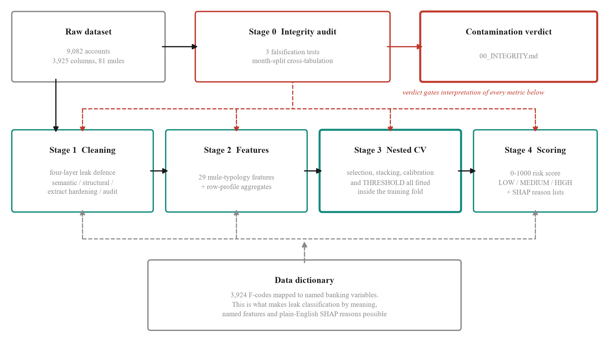
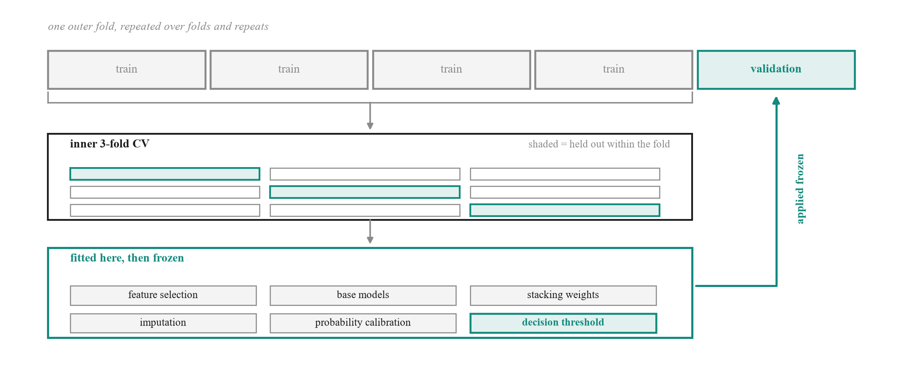
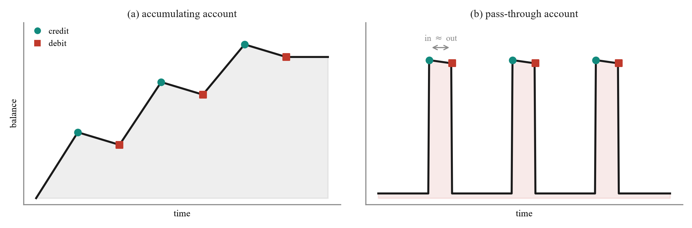
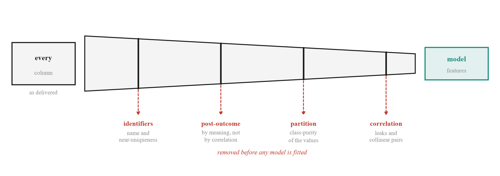

# MuleGuard AI

**A transaction ledger goes in. A ranked investigator queue comes out — with the
reason for every alert and the window of time the account was being used.**

Money-mule detection for the PSB Cybersecurity, Fraud & AI Hackathon 2026
(Bank of India × IIT Hyderabad). Four detectors run in parallel and a fitted
model decides what each is worth.

```
account_id, is_mule, suspicious_start, suspicious_end
```

<p align="center">
  
</p>

---

## What it scores

Measured on **SAML-D**, a public AML dataset we did not create and cannot tune
against. 493,833 accounts; the model is fitted on a training split and scored on
accounts it has never seen.

| Held out: 148,150 accounts · base rate 0.461% | |
|---|---|
| **AUPRC** | **0.421** — 91× the base rate |
| **Precision, top 50 reviewed** | **70%** — 152× lift |
| Recall, top 1,000 reviewed | 61.4% |
| AUROC | 0.985 |

**Remove the network layer and AUPRC falls to 0.325.** Same ledger, same split,
same seed, same model — only the 10 motif/ring/role columns vary. That is an
ablation, not an assertion.

On the supplied hackathon file, which is account-level with no transactions, the
behavioural half runs alone: **precision 0.989**, a 49-account freeze band that
is **100% mules**, and **91% of all mules** caught by reviewing 2.6% of the book.
Read those next to [what that benchmark can and cannot prove](docs/data-integrity.md).

---

## Quick start

```powershell
.\run.ps1              # Windows: creates the venv, installs, runs every stage
.\run.ps1 -Serve       # then the UI at http://127.0.0.1:8000
```

```bash
./run.sh               # macOS / Linux
./run.sh serve
```

**Given a dataset live?** Drag it into **02 UPLOAD DATASET** in the UI, or:

```bash
./run.sh dataset /path/theirs.csv     # writes under runs/theirs/, never touches your results
```

It works out the target column, the identifiers, the leak columns and the
partition columns for itself. Needs **Python 3.11 or 3.12**; on macOS also
`brew install libomp`. Details in [SETUP.md](SETUP.md).

---

## The five questions it answers

Most systems answer one. A bank needs all five, and each needs different
machinery.

### 1. Can I trust this data at all?

Three falsification tests, run **before** any model is fitted. Give a model only
the pattern of which cells are blank — every value discarded — and it still
reaches **0.824 AUPRC** against a 0.0089 baseline. Shuffle the labels and the
whole thing collapses to the baseline, which is what proves the harness is sound.

The challenge brief allocates **15% of the score to avoiding injected
red-herrings**. This is that criterion being answered.
→ [Data integrity](docs/data-integrity.md)

### 2. Is this account a mule?

Four independent leak gates, then behavioural features, then a stacked ensemble
under nested repeated cross-validation with **the decision threshold fitted
inside the training fold** — the single most common way a fraud result gets
inflated.

<p align="center">
  
</p>

→ [How it works](docs/method.md)

### 3. Why was it flagged?

SHAP attributions computed **per fold, out of fold**, in named banking variables
— so the explanation comes from a model that never trained on the account it is
explaining. Global feature importance explains the model; an investigator needs
the reason for *this* account.

### 4. When was it being used?

A start and end timestamp, scored by temporal IoU. Every day gets a suspicion
score; the contiguous interval carrying the most excess is taken by maximum
subarray. Choosing the baseline by Otsu's method rather than the median is the
difference between **0.998 and 0.063 IoU**.
→ [The whole system](docs/end-to-end.md)

### 5. Who else is involved?

Three tools, because they fail in different places: seeded propagation needs
confirmed mules to start from, structural ring detection needs the cell to be
*separable*, and motif detection needs neither.
→ [Networks](docs/network-detection.md)

---

## What separates a mule from a customer

<p align="center">
  
</p>

Neither account is unusual on paper — same KYC, same address, same salary
history. The separation is entirely in the shape of that line, and the shape is
arithmetic, which is why it still means the same thing at another bank.

---

## Four ways a model could cheat, and where each is stopped

<p align="center">
  
</p>

Each gate catches a class of leakage the others would miss. The third is the one
almost nobody builds: it finds a column whose **values are class-pure** — the
fingerprint of a dataset assembled along a line that happens to track the label —
from structure alone, with no knowledge of the schema.
→ [Data integrity](docs/data-integrity.md)

---

## What it refuses to do

These are design constraints, not unfinished work. Each is a place where the easy
version would have scored better and meant less.

| | |
|---|---|
| **Won't invent a graph** | No counterparty data, no network. The stage disables itself and says why. |
| **Won't guess the label** | Ambiguity raises an error naming the candidates. A silently wrong target is the worst failure, because everything downstream still looks like it worked. |
| **Won't hide a failed component** | The isolation forest scores below random and is reported with its **−0.44** stacking weight. 7 of 12 AML rules don't beat the base rate, and that is published. |
| **Won't report accuracy** | At this prevalence it rewards doing nothing. |
| **Won't file anything** | Case packs assemble what a human needs. The decision and the filing stay with the human. |
| **Won't act alone indefinitely** | The drift policy has a written condition — weighted PSI ≥ 0.50 — under which **automated freezing stops until a human signs off**. |

---

## Documentation

| Document | What is in it |
|---|---|
| **[How it works](docs/method.md)** | Schema resolution, role matching, the feature layer, leak defences, and why the metrics are trustworthy as metrics |
| **[Data integrity](docs/data-integrity.md)** | The falsification tests, what they found, and the ablation that bounds how much of a score is artefact |
| **[Networks](docs/network-detection.md)** | Ring detection, motif detection, and what a third-party benchmark said about both |
| **[The whole system](docs/end-to-end.md)** | Temporal localisation and the unified scorer, measured end to end |
| **[Operations](docs/operations.md)** | The command centre, alert export, label noise, and the drift re-selection policy |
| **[Reference](docs/reference.md)** | Pipeline stages, layout, limitations, and how to reproduce every number |
| [SETUP.md](SETUP.md) | Environment, prerequisites, troubleshooting |
| [reports/00_INTEGRITY.md](reports/00_INTEGRITY.md) | The integrity finding in full |

---

## A note on what is in this repository

**Every number here is read from a report file, not typed into a table.** The
benchmark evidence is published alongside the claims — `reports/bench_unified/`
and `reports/bench_saml/` — so anyone can re-run `src/bench_unified.py` and check.

The supplied dataset, the trained model and the generated alert records are
**deliberately git-ignored**. The alerts name real accounts as suspected mules
and are joinable back to the source file by row index, so they are not published.
Everything here regenerates them from your own copy of the data.

```bash
python -m pytest tests/ -q      # 143 tests
```

Runs on Windows, macOS and Linux from one source tree: `pathlib` throughout,
UTF-8 forced on all I/O, no shell calls, no hardcoded paths.
